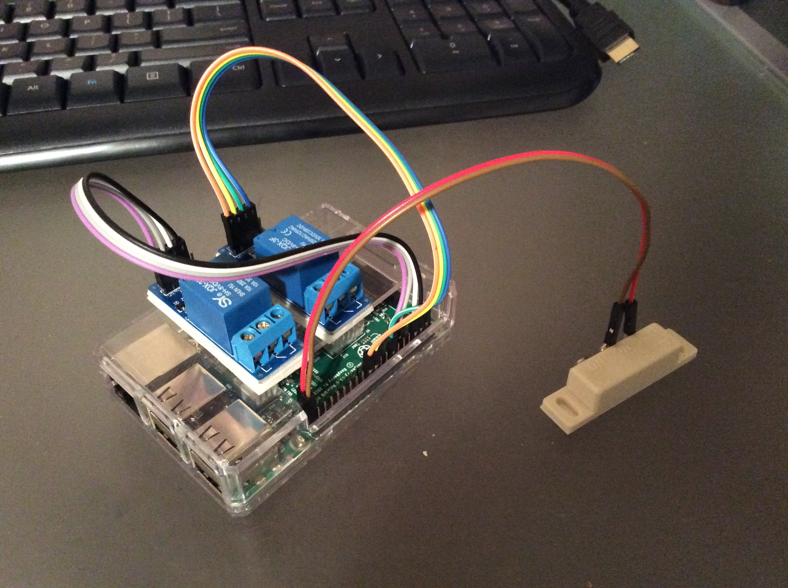

This is my home project that trys to control my garage. I have a raspberry pi 3 that equiped with 2 relays. One of which triggers the door and the other one switch on/off a light blub. I also have a reed switch connected to the pi for detecting the door state. 

##Language Choice
I want to try new languages and framework as much as possible, which might not be the best idea for the production environment 

- GPIO controller, NodeJS
- Web Interface, Angular 2 

##User Stories

###As a tenant, 
1. **[Done]I want to automatically turn on/off the garage light when the garage door is open/close, so that I don't have to walk to the car in the dark.**
1. I want to monitor my garage door state on the phone, so that I don't have to perform a visual check.
1. I want to open the garage door automatically when I drive home, so that I don't have to stop and find my remote.

##Dev Note

Install Bonjour

	$ sudo apt-get install libnss-mdns
	
Update NodeJS service on Pi

	$ garagepi.sh stop
	$ git pull 
	$ npm install	
	$ garagepi.sh start
	
